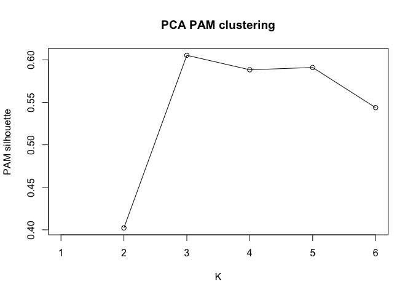
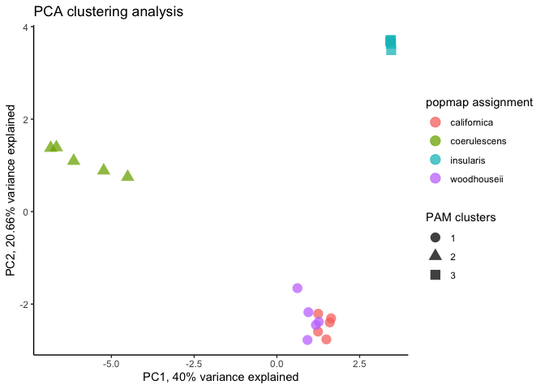
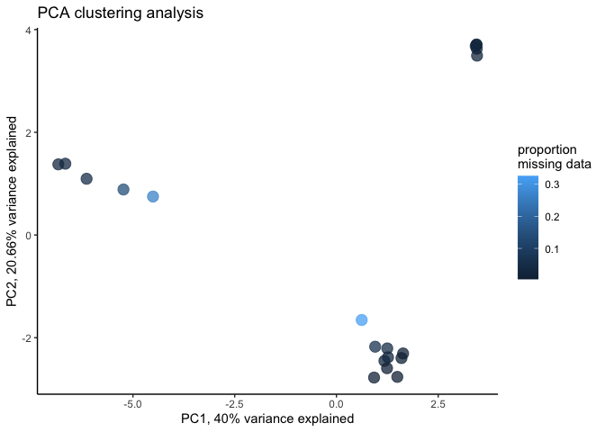
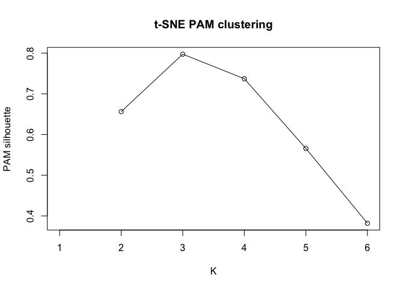
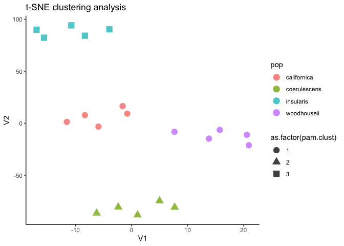
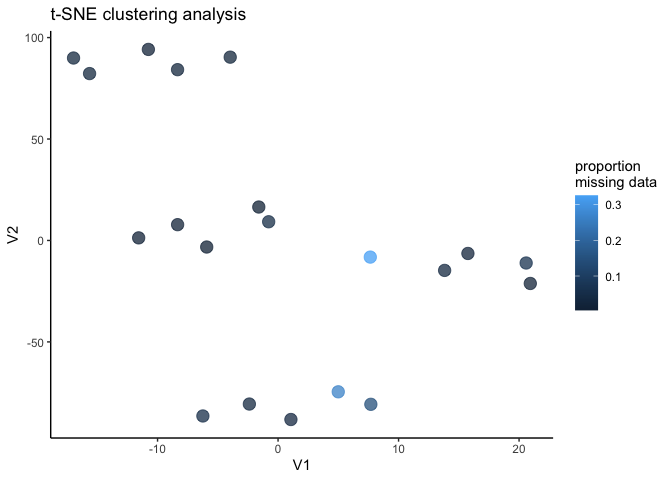
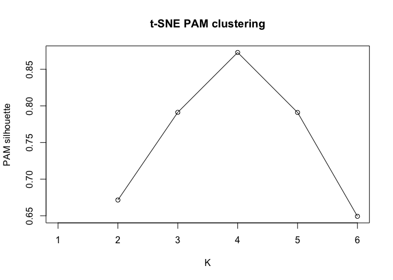
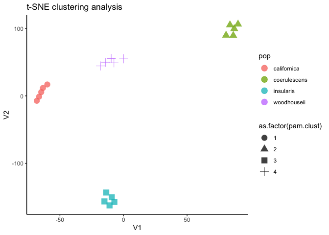
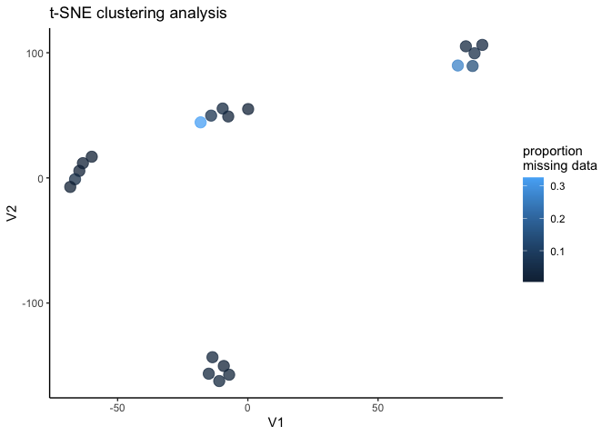

<!-- README.md is generated from README.Rmd. Please edit that file -->

# species.clusteRs

<!-- badges: start -->


<!-- badges: end -->

species.clusteRs is an in-development package for performing
clustering-based species delimitation on SNP data from natural
populations.

## Installation

You can install the development version from
[GitHub](https://github.com/) using the following code:

``` r
# install.packages("devtools")
devtools::install_github("DevonDeRaad/species.clusteRs")
```

## Example

This is a basic example which shows you how to solve a common problem:

``` r
library(species.clusteRs)
## basic example code for unsupervised clustering using PCA for dimensionality reduction
pcs<-cluster_pca(vcfR = species.clusteRs::vcfR.example,
            popmap = species.clusteRs::popmap)
#> Loading required namespace: adegenet
#> Registered S3 method overwritten by 'spdep':
#>   method   from
#>   plot.mst ape
```



``` r
#basic example code for using tsne for dimensionality rection
tsne<-cluster_tsne(vcfR = species.clusteRs::vcfR.example,
            popmap = species.clusteRs::popmap)
```



``` r
#Does decreasing perplexity improve cluster discrimination?
tsne<-cluster_tsne(vcfR = species.clusteRs::vcfR.example,
            popmap = species.clusteRs::popmap,
            perplexity = 3)
```


